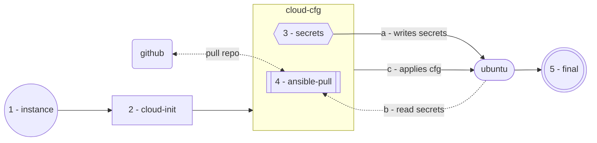

# Password Zero

When spinning up a compute node, the instance must have some access to an initial secret or privilege to unlock resources and data. This document refers to the initial secret as password zero. It solves a problem that might be trivial in the public cloud space, like AWS, using instance profiles with IAM roles.  

For our use case, we are using the LXD/Incus hypervisor. Since the hypervisor does not have this functionality built in, we must develop a homegrown solution to solve this problem. As with everything else in this documentation, we want to solve it using the simplest solution. However, in some situations, complex complexity is unavoidable.

## Use case
In our scenario, we want to be able to use cloud-based generic images and Ansible at launch time to apply varied customizations depending on workload. Fortunately, the Incus hypervisor offers a wide variety of images to choose from. For this example, we will use the Ubuntu operating system. Most modern operating systems function similarly.  

We'll start with an example of solving the problem using cloud-init, which is widely available on all the major public cloud providers. It also allows us to explore a quick and initial solution.

For example, workflow steps are listed below.

* An instance is created, and the operating system is booted.
* Cloud-init runs on the instance and applies the initial configuration.
	* An SSH key is required to access the private git repository.
	* The Ansible vault password is required to decrypt stored in the git repo.
* Ansible fetches the code from the get repo using the private key on the disk.
* Ansible then runs the configuration locally on the instance using the vault password provided.
* The instance is now ready for consumption post configuration.

<!--stackedit_data:
eyJoaXN0b3J5IjpbLTE2ODUwMDUzNzEsLTE2MDU0ODkyMjcsOT
AwNDk3OTY1LC0xMzcyNzg2OTc1LDExMzI4NTI1NDgsMTI4Mzc2
MzU0MCwxOTM0NTA4MTI1LC0xMTM0MjU3NTIyLDExMTA5MzQyNj
QsNTI0ODQxNTIwLC0xOTI4MzUzNjU1LDE1NzQ4MzYwNzMsLTkw
NzkyMTU0MywtODM3NzAxNDM1XX0=
-->