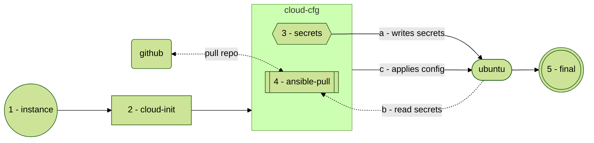

# Password Zero

When spinning up a compute node, the instance must have some access to an initial secret or privilege to unlock resources and data. This document refers to the initial secret as password zero. It solves a problem that might be trivial in the public cloud space, like AWS, using instance profiles with IAM roles.  Instant profiles allow birthright privileges. As such, an instance could access the AWS secret manager or HashiCorp Vault.

For our use case, we are using the LXD/Incus hypervisor. Since the hypervisor lacks built-in secret management functionality, we must develop a custom solution to address this problem. As with everything else in this documentation, we aim to solve it using the simplest approach. However, in some circumstances, complexity is unavoidable.

## Use case
In our scenario, we want to customize the workload using cloud-based generic images and Ansible at launch time. Fortunately, the Incus hypervisor offers a wide variety of images. We will use the Ubuntu operating system for this example, but most modern operating systems function similarly.  

We'll start with an example of solving the problem using cloud-init, which is widely available on all the major public cloud providers. It also allows us to explore a quick and initial solution.

For example, workflow steps are listed below.

* An instance is created, and the operating system is booted.
* Cloud-init runs on the instance and applies the initial configuration.
	* An SSH key is required to access the private git repository.
	* The Ansible vault password is required to decrypt stored in the git repo.
* Ansible fetches the code from the get repo using the private key on the disk.
* Ansible then runs the configuration locally on the instance using the vault password provided.
* The instance is now ready for consumption post configuration.

Effectively, this allows us to inject secrets using cloud-init and, then, with a different module, run `ansible-pull` to utilize the secrets. See technical details [here](solutions/lxd-cloud-init.md).

## Review 

### cloud-init ansible-pull
After reviewing the solution presented with Cloud-init and LXD, we found that it easily meets our requirements. The solution allows us to use a generic cloud image without needing a custom image. Cloud-init injects the secrets very early in the boot process. Now, we can utilize these credentials to pull our Ansible repository using the private key as an authentication method. Further, the vault password file can decrypt the secrets stored with the source code.

Although this solution might be viable for a single tenant storing secrets in plain text on the OS file system or in the LXD database, it's probably not desirable. However, to access the LXD profile, one would have certain entitlements. Similarly, to access a file on an operating system owned by the root, you must have elevated privileges. The solution is a `quick` example of integrating cloud-init with an ansible-pull for quick post-up configurations on an instance.

A couple of things to remember is that you want to make sure that the SSH key you're using is set up so that it only has read access to the repository. You would want to add steps to your deployment to clean up the secrets and the git repository, especially if the job only runs once at instance instantiation.

