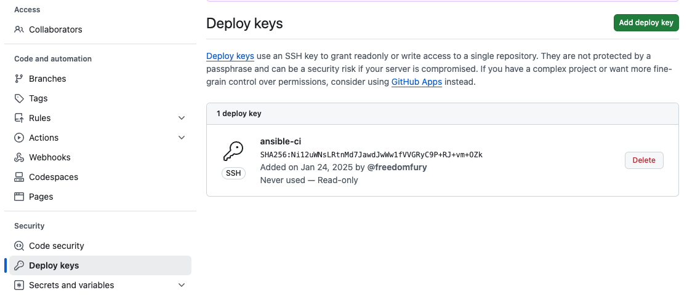

# Using CloudInit to inject initial secrets

Using cloud-init to set authentication credentials is relatively straightforward. The LXD hypervisor allows us to set profiles that store configuration and metadata about an instance. Cloud-init also enables you to insert arbitrary files. This functionality lets us insert the `password zero` secret to bootstrap the instance. This solution is compatible with most public clouds, making it familiar to anyone with cloud-init experience.

This example assumes that you have a working LXD instance configured with the default settings. Setting up LXD or Incus is relatively simple. Please take a look at the respective authors for instructions on installation. We will create a system administration user that will consume the credentials later. It is important to ensure the files created are only readable by the owner.

1. Create an SSH key pair. This key will be used to set up access to your git repository. 
   ```
   ssh-keygen -b 2048 -t rsa -f id_rsa -q -N ""
   ```

1. Add the public SSH key to your GitHub repository. In my case, I will be using the deployment key feature from GitHub.

   
 
*In most scenarios, you should set your deployment key to read-only access.*
   

1. Generate a cloud-config snippet and store it as the user data value in the LXD profile. Remember that the user profiles in LXD are `yaml` based and cloud-config settings. The user-data section of the profile is a multiline literal string that begins with the cloud-init comment(s) stanza.
   ```
   cat <<EOF > profile-ci.yml
   > config:
     user.user-data: |-
       #cloud-config
       package_update: true
       package_upgrade: true
       packages:
         - git
         - ansible-core
       users:
       - name: sysadm
         gecos: System Administrator
         shell: /bin/bash
         groups: users,admin,wheel
         sudo: ALL=(ALL) NOPASSWD:ALL
       write_files:
         - path: /home/sysadm/.sec/id_rsa
           owner: sysadm:sysadm
           permissions: "0600"
           defer: true
           encoding: base64
           content: |-
             LS0tLS1CRUdJTiBPUEVOU1NIIFBSSVZBVEUgS0VZLS0tLS0KYjNCbGJuTnphQzFyWlhrdGRqRUFB
             QUFBQkc1dmJtVUFBQUFFYm05dVpRQUFBQUFBQUFBQkFBQUJGd0FBQUFkemMyZ3RjbgpOaEFBQUFB
             d0VBQVFBQUFRRUF2UVAvbGRBb0Y5WkZHT2hLOXBXNmxsNE1KWGJUdlVhN3QvOXc3QVhzUkdsTExS
             NjE5SGlLCjFoNUdQ<<NOT_A_SSH_PRIVATE_KEY >>DRDZWlaZE9Qck9WZitSeHg5WE5CWDZVQU9
             RQpBb2YveW1Obktpd2RjZ3N5M0t5emgwc1JKeldyN0VtWkQvU2JJSGJGT0hCbkZHeVo0L1NHZzda
             RGJlZzZ2T0VQQU5SbmM4CncyemR0anhBM0E0Uzl4YzY2cWZrMVlvQXF0OU9kOHR1aTNWOEpkTFQ4
             cFA1a3l1dXdLcElrc0d0N1JKRXJJcHJOMmNkUmIKL1JaWE5CWDZVQU90M2lzYkFBQUFGR1p5Wlda
             MWNrQndhQzFzZUdSek1ERXRjM1JuQVFJREJBVUcKLS0tLS1FTkQgT1BFTlNTSCBQUklWQVRFIEtF
             WS0tLS0tCg==
         - path: /home/sysadm/.sec/pw_vault
           owner: sysadm:sysadmin
           permissions: "0600"
           defer: true
           content: <<NOT_A_PASSWORD>>
       ansible:
         package_name: ansible-core
         install_method: distro
         pull:
           url: git@github.com:freedomfury/ansible_lxd.git
           playbook_name: main.yml
           private_key: /home/sysadm/.sec/id_rsa
           vault_password_file: /home/sysadm/.sec/id_rsa
   description: Inject private key and vault password
   devices:
     eth0:
       name: eth0
       network: lxdbr0
       type: nic
     root:
       path: /
       pool: default
       type: disk
   name: base-sec
   used_by: []
   project: default
    > EOF
   ```
   The example playbook can be found [here](./lxd-ci-playbook.md). The playbook presents various sample commands to ensure that cloud-init was executed correctly. You would naturally modify the playbook's content to suit your specific needs.
   
1. Set up LXD profile to be used at instance launch time.
   ```
   inc profile create base-sec < profile-ci.yml

   incus profile list
    +----------+---------------------------------------+---------+
    |   NAME   |              DESCRIPTION              | USED BY |
    +----------+---------------------------------------+---------+
    | base-sec | Inject private key and vault password | 0       |
    +----------+---------------------------------------+---------+
   ```

1. Launch an instance using the newly created profile. In this case, I'm using the prebuilt containers from LXD's image server. The vendor created these pre-configured images, which have no personalized customizations. 
   ```
   inc launch images:ubuntu/noble/cloud ct-ubun00-dev -p base-sec

   inc list
    +---------------+---------+--------------------+------+-----------+-----------+
    |     NAME      |  STATE  |        IPV4        | IPV6 |   TYPE    | SNAPSHOTS |
    +---------------+---------+--------------------+------+-----------+-----------+
    | ct-ubun00-dev | RUNNING | 172.17.5.25 (eth0) |      | CONTAINER | 0         |
    +---------------+---------+--------------------+------+-----------+-----------+
   ```
1. Validate that the cloud-init was completed successfully.
   ```
   inc exec ct-ubun00-dev -- cloud-init status --wait
    status: done
   ```
   1. If you encounter any errors, you will want to log into the instance and check the cloud-init logs. Sometimes, the error message can be useful and help troubleshoot your issue.
      ```
      inc shell ct-ubun00-dev
      root@ct-ubun00-dev:~# whoami
      root
      ```
      > LXD has a predefined alias `shell` that allows users to attach to the running instance as root.

   1. Cloud logging is very verbose intentionally. You'll most likely search for Python stack traces in the logs.         
      ```
      # /var/log/cloud-init.log
      
      2025-01-24 08:34:03,676 - log_util.py[DEBUG]: Running module ansible (<module 'cloudinit.config.cc_ansible' from '/usr/lib/python3/dist-packages/cloudinit/config/cc_ansible.py'>) failed
         Traceback (most recent call last):
         cloudinit.subp.ProcessExecutionError: Unexpected error while running command.
         Command: ['ansible-pull', '--private-key=/home/sysadm/.sec/id_rsa', '--url=https://github.com/freedomfury/ansible_lxd', '--vault-password-file=/home/sysadm/.sec/id_rsa', 'main.yml']
         Exit code: 2
         Reason: -
         Stdout: localhost | FAILED! => {
                     "changed": false,
                     "msg": "Failed to find required executable \"git\" in paths: /usr/local/sbin:/usr/local/bin:/usr/sbin:/usr/bin:/sbin"
                 }
                 Starting Ansible Pull at 2025-01-24 08:34:03
                 /usr/bin/ansible-pull --private-key=/home/sysadm/.sec/id_rsa --url=https://github.com/freedomfury/ansible_lxd --vault-password-file=/home/sysadm/.sec/id_rsa main.yml
         Stderr:
      ```
      In this example, the package git is not installed on the instance by default, so the ansible-pull command fails to fetch the repository.

1. Check if secret files were created on the operating system.
    ```
    inc exec ct-ubun00-dev -- ls -lh /home/sysadm/.sec/
    total 3.0K
    -rw------- 1 sysadm sysadm 1.8K Jan 23 08:40 id_rsa
    -rw------- 1 sysadm sysadm   36 Jan 23 08:40 pw_vault
    ```
1. Clean up temporary files used to create the profile on the local development machine.
   ```
   rm -f id_rsa*  profile-ci.yml
   ```

With the above configuration in place, every new instance launched will trigger cloud-init to have Ansible pull the configurations from GitHub. With a little more tweaking, you could pass a variable to specify an Ansible group. This group variable would enable on-the-fly configuration of different systems in various roles. You can create databases, web servers, or any other server roles you might need from the same base profile. The only drawback is that the servers won't be instantly available, and there will be a significant delay from boot time to when the server is ready. The duration of the delay will depend on the complexity or intensity of the post-setup configuration.

